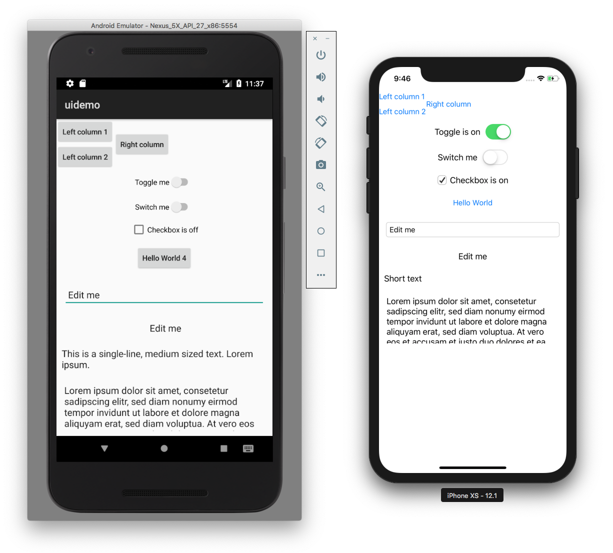

# Boden Cross-platform Framework 🏗[Preview Release]🏗

Rock solid and truly native C++ cross-platform framework for Android and iOS development



* **Native widgets**: Instead of drawing widgets that look nearly identical to the platform's design, Boden uses native OEM widgets ensuring that your app will always have a truly native look and feel.
* **Fast**: Boden is written in modern C++11 to make development easy and apps fast and battery-friendly.
* **Open**: Boden is an open framework and welcomes contributions and feedback from the community. We want you to shape its development so Boden can meet your requirements.

> 🚧👷‍♂️ We are happy to release our first preview of the Boden framework. Please be aware that this is an early preview release featuring a small set of widgets and limited layout functionality. We’re happy about your [feedback](#contact--feedback).

## Table of Contents

* [Setup](#setup)
* [Getting Started](#getting-started)
* [Hello World](#hello-world)
* [Dependency Installation Guide](#dependency-installation-guide)
* [Troubleshooting](#troubleshooting)
* [Contact & Feedback](#contact--feedback)

## Setup

You can use macOS to build both iOS and Android apps. Windows and Linux can be used to build Android apps only. This guide will help you set up your system for developing Boden apps.

Which platform do you want to set up for development?

* [macOS](#building-boden-apps-on-macos)
* [Windows](#building-boden-apps-on-windows)
* [Linux](#building-boden-apps-on-linux)

### Building Boden Apps on macOS

Choose your target platform: [iOS](#ios-apps) or [Android](#android-apps).

### iOS Apps

To build iOS apps on macOS, the following dependencies need to be installed:

1. macOS 10.13.6 High Sierra or newer
2. [Xcode 9.2+](https://developer.apple.com/xcode/) (with Command Line Tools installed)
3. [Python 3.4+](https://www.python.org/downloads/)
4. [CMake 3.10.2+](https://cmake.org/download/)

> If you are not sure whether all of the dependencies listed above are installed, jump to the [Dependency Installation Guide for iOS on macOS](#setting-up-macos-for-ios-builds) and follow the steps listed there.

Follow these steps to set up Boden for iOS development:

1. Open the Terminal app and clone the git repository: 

		git clone https://github.com/AshampooSystems/boden.git

3. Run the `boden` build tool to generate an Xcode project:

		cd boden
		./boden prepare -p ios

4. Open the generated project in Xcode:

		open build/ios/std/Xcode/boden.xcodeproj

5. In Xcode select the `uidemo` target and press <kbd>Cmd</kbd>+<kbd>R</kbd> to build and run the example application.

Continue to the [Getting Started](#getting-started) section to learn how to create your first boden app.

### Android Apps

To build Android apps on macOS, the following dependencies need to be installed:

1. macOS 10.13.6 High Sierra or newer
2. Command Line Tools
3. [OpenJDK 8](https://openjdk.java.net/)
4. [Python 3.4+](https://www.python.org/downloads/)
5. [CMake 3.10.2+](https://cmake.org/download/)
6. [Android Studio](https://developer.android.com/studio) (with Android NDK)

> If you are not sure whether all of the dependencies listed above are installed, jump to the [Dependency Installation Guide for Android on macOS](#setting-up-macos-for-android-builds) and follow the steps listed there to install them.

Follow these steps to set up Boden for Android development on the Mac:

1. Open the terminal and clone the git repository:

		git clone https://github.com/AshampooSystems/boden.git

2. Run the `boden` build tool to prepare an Android Studio project:

		cd boden
		./boden prepare -p android

4. Run Android Studio and open `boden/build/android/std/AndroidStudio`.

5. Wait for Android Studio to finish its gradle sync and configuration, then select the `uidemo` target and press <kbd>Ctrl</kbd>+<kbd>R</kbd> to build and run the example application.

Continue to the [Getting Started](#getting-started) section to learn how to create your first boden app.

### Building Boden Apps on Windows

To build Android apps on Windows, the following dependencies need to be installed:

1. Windows 10
2. [Python 3.4+](https://www.python.org/downloads/)
3. [CMake 3.10.2+](https://cmake.org/download/)
4. [Git](https://git-scm.com/download/win)
5. [Oracle JDK 8](https://www.oracle.com/technetwork/java/javase/downloads/jdk8-downloads-2133151.html)
6. [Android Studio](https://developer.android.com/studio) (with Android NDK)

> If you are not sure whether all of the dependencies listed above are installed, jump to the [Dependency Installation Guide for Android on Windows](#setting-up-windows-for-android-builds) and follow the steps listed there to install them.

Follow these steps to set up Boden for Android development on Windows 10:

1. Open a Command Prompt: Hit <kbd>Win</kbd>+<kbd>R</kbd>, type `cmd` and then hit Enter.
2. Clone the git repository:

		git clone https://github.com/AshampooSystems/boden.git

3. Run the `boden.py` build tool to generate an Android Studio project:

		cd boden
		python boden.py prepare

4. Run Android Studio and open `boden/build/android/std/AndroidStudio`.

5. Wait for Android Studio to finish its gradle sync and configuration, then select the `uidemo` target and press <kbd>Shift</kbd>+<kbd>F10</kbd> to build and run the example application.

Continue to the [Getting Started](#getting-started) section to learn how to create your first boden app.

### Building Boden Apps on Linux

To build Android apps on Linux, the following dependencies need to be installed:

1. Ubuntu 18.04
2. Git
3. [OpenJDK 8](https://openjdk.java.net/)
4. [Python 3.4+](https://www.python.org/downloads/) (with `python3-distutils`)
5. [CMake 3.10.2+](https://cmake.org/download/)
6. qemu-kvm
6. [Android Studio](https://developer.android.com/studio/) (with Android NDK)

> If you are not sure whether all of the dependencies listed above are installed, jump to the [Dependency Installation Guide for Android on Linux](#setting-up-linux-for-android-builds) and follow the steps listed there to install them.

Follow these steps to set up Boden for Android development on Ubuntu:

1. Open up a terminal and clone the git repository:

		git clone https://github.com/AshampooSystems/boden.git

3. Run the `boden` build tool to generate an Xcode project:

		cd boden
		./boden prepare

4. Run Android Studio and open `boden/build/android/std/AndroidStudio`.

5. Wait for Android Studio to finish its gradle sync and configuration, select the `uidemo` target and press <kbd>Shift</kbd>+<kbd>F10</kbd> to build and run the example application.

> If Android Studio displays an error stating that permission to `/dev/kvm` is denied, make sure that you have added your user to the `kvm` group.

## Getting Started

To create your first Boden project, open up a terminal (or command prompt), change to your local `boden` directory, and execute the following commands:

	python boden.py new -n AwesomeApp
	cd AwesomeApp
	python ../boden.py open

This will create a new folder named `AwesomeApp` and generate source and project files for a simple Hello World cross-platform application. The last command will prepare and open an Xcode project on the Mac or an Android Studio project on Linux/Windows.

In Xcode, select the `AwesomeApp` target and then press <kbd>Cmd</kbd>+<kbd>R</kbd> to build and run the Hello World application.

In Android Studio, wait for Gradle to finish its sync and configuration processes and then select the `uidemo` target and press <kbd>Cmd</kbd>+<kbd>R</kbd> to build and run the example application, then select the `AwesomeApp` target and then press <kbd>Ctrl</kbd>+<kbd>R</kbd> on Mac or <kbd>Shift</kbd>+<kbd>F10</kbd> on Linux/Windows to build an run the Hello World application.

> Note: On macOS and Linux you can also simply type `./boden` instead of calling `python boden.py` explicitly. If you want to build the Android version of the app on macOS, run `../boden open -p android`.

## Hello World

Let's take a quick look at the source code generated by the `boden new` command:

```C++
// MainViewController.cpp

#include <bdn/init.h>
#include <bdn/Button.h>

#include "MainViewController.h"

MainViewController::MainViewController()
{
    _window = bdn::newObj<bdn::Window>();
    _window->setTitle("AwesomeApp");

    bdn::P<bdn::Button> button = bdn::newObj<bdn::Button>();
    button->setLabel("Hello World");

    _window->setContentView(button);
    _window->requestAutoSize();
    _window->requestCenter();

    _window->setVisible(true);
}
```

`MainViewController.cpp` is the most interesting part of the source generated for the Hello World application. The main view controller will be instantiated at application launch. It's responsible for setting up the application's user interface. Let's take a deeper look at the source:

First, we create a new `Window` and set its title to `AwesomeApp`.

```C++
_window = bdn::newObj<bdn::Window>();
_window->setTitle("AwesomeApp");
```

We then instantiate a new `Button` and set its label to "Hello World".

```C++
bdn::P<bdn::Button> button = bdn::newObj<bdn::Button>();
button->setLabel("Hello World");
```

As the button is the only control which we will be displaying in this example, we'll set it as the window's content view.

```C++
_window->setContentView(button);
```

Finally, we need some boilerplate code to set the window's geometry and visibility.

```C++
_window->requestAutoSize();
_window->requestCenter();

_window->setVisible(true);
```

## Dependency Installation Guide

### Setting up macOS for iOS builds

#### 1. Install Xcode

1. Open the App Store app by clicking on the Apple logo in the menu bar and then selecting “App Store...".
2. Click on the search field and type Xcode.
3. Locate Xcode and click Get.
4. The store page for Xcode opens up. Click the Get button again.
6. Once installed, open Xcode by clicking Open and agree to the terms of service. Xcode will install components afterwards.
7. Finally, open up a terminal and run `sudo xcode-select -s /Applications/Xcode.app/Contents/Developer`.

#### 2. Install Homebrew, Python, and CMake

1. Install Homebrew:

		/usr/bin/ruby -e "$(curl -fsSL https://raw.githubusercontent.com/Homebrew/install/master/install)"

2. Install Python and CMake: 

		brew install python3 cmake

### Setting up macOS for Android builds

#### 1. Install Homebrew, Java, Python, and CMake

1. Install Homebrew:

		/usr/bin/ruby -e "$(curl -fsSL https://raw.githubusercontent.com/Homebrew/install/master/install)"

2. Install Java 8:

		brew tap caskroom/versions
		brew cask install java8

4. Install Python and CMake:

		brew install python3 cmake

#### 2. Install Android Studio

##### 2.1 Download Android Studio

1. Go to https://developer.android.com/studio.
1. Click “Download Android Studio".
1. Agree to the Terms and Conditions.

##### 2.2 Complete the Installation

1. Once the download is completed, open the DMG.
1. Drag Android Studio.app and drop it on the Applications folder icon.
1. Open Android Studio using Finder or Spotlight.
1. Follow the steps in the setup wizard.
3. Stay on the "Welcome to Android" screen and complete the steps below to complete the installation.

> For Boden, it's sufficient to select the default setup type in the Android Studio Setup wizard. When asked, grant permission to the Intel HAXM installer to allow for Android device emulation.

##### 2.3 Install Android NDK

1. On the “Welcome to Android” screen, click “Configure” and select “SDK Manager".
1. Click on the “SDK Tools” tab.
1. Select “NDK” from the list and click OK.
1. A prompt appears asking you to confirm the change. Do so by clicking OK.
1. Accept the NDK license agreement.
1. The NDK component is being installed, grab another drink.
1. After the installation has finished, click Finish. The installation is now complete.

### Setting up Windows for Android builds

#### 1. Install Python, CMake, Git, and JDK 8

1. Download and install Python3 from https://www.python.org/downloads/ (ca. 25MB).
	
	> Important: Make sure to activate the “Add Python to PATH" checkbox at the bottom of the installer window.

1. Download and install CMake from https://cmake.org/download/ (ca. 19MB). We recommend using the latest win64-x64 stable release installer binary.

1. Download and install git from https://git-scm.com/download/win (ca. 42MB). If you’re unsure about the available options presented in the installer, just keep the default settings.

	> Important: When installing CMake, make sure to choose “Add the Cmake binary to the PATH environment variable”.

1. Dowload and install JDK 8 from https://www.oracle.com/technetwork/java/javase/downloads/jdk8-downloads-2133151.html (ca. 200MB).

#### 2. Install Android Studio

##### 2.1 Download and Install Android Studio

1. Download Android Studio from https://developer.android.com/studio/ (ca. 1GB) and start the downloaded EXE file.
2. Follow the steps in the setup wizard.
3. Stay on the "Welcome to Android" screen and complete the steps below to complete the installation.

> For Boden, it's sufficient to select the default setup type in the Android Studio Setup wizard. When asked, grant permission to the Intel HAXM installer to allow for Android device emulation.

##### 2.2 Install Android NDK

1. On the “Welcome to Android” screen, click Configure and select SDK Manager.
1. Click on the SDK Tools tab.
1. Select NDK from the list and click OK.
1. Confirm the change by clicking OK in the popup window.
1. Accept the NDK license agreement.
1. The NDK component is being installed, grab another drink.
1. After the installation has finished, click Finish. The installation is now complete.

### Setting up Linux for Android Builds

#### 1. Install Git, Python, CMake, OpenJDK, and qemu-kvm

Open up a terminal and run the following command:

	sudo apt update && sudo apt install git cmake python3-distutils openjdk-8-jdk qemu-kvm

#### 2. Install Android Studio

1. Download Android Studio from https://developer.android.com/studio/ (ca. 1GB) and unpack the downloaded ZIP file.

1. Open up a terminal and change to the directory to which you unpacked the ZIP file. To start Android Studio, run the following commands:

		cd android-studio/bin
		./studio.sh

1. Follow the steps in the setup wizard to complete the installation.

1. If you want to run Android Applications in the Android Emulator, follow the steps below.

#### 2. Install Android NDK

1. On the “Welcome to Android” screen, click Configure and select SDK Manager.
1. Click on the SDK Tools tab.
1. Select NDK from the list and click OK.
1. Confirm the change by clicking OK in the popup window.
1. Accept the NDK license agreement.
1. The NDK component is being installed, grab another drink.
1. After the installation has finished, click Finish. The installation is now complete.

#### 3. Configure Ubuntu for Running Android Emulator

1. Open up a terminal and run the following command:

		sudo adduser YOUR_USERNAME kvm

1. Log out of Ubuntu by typing:

		gnome-session-quit

2. Log back in. Android Emulator should now work on your system.

## Troubleshooting

### 1. Android Emulator won't start on Ubuntu Linux due to permission denied error

Make sure that the `qemu-kvm` package is installed and your user is a member of the `kvm` group. See [Configure Ubuntu for Running Android Emulator](#3-configure-ubuntu-for-running-android-emulator) for further instructions.

### 2. `boden prepare` fails with a CMake error when setting up a Windows machine for Android development

Double-check whether the right Java version is installed. Android Studio requires the `openjdk-8-jdk` package on Ubuntu Linux or [Oracle JDK 8](https://www.oracle.com/technetwork/java/javase/downloads/jdk8-downloads-2133151.html) on Windows. Other Java versions are not supported.

### 3. The Run and Build functions in Android Studio are disabled

Android Studio needs several minutes for its initial preparation (gradle sync, etc.) when the project is first opened. If the build and run functions remain disabled after the preparation has finished please wait an additional minute or two. If they remain disabled then you may be experiencing a sporadically occurring Android Studio bug. Solution: click on the "N processes running" entry in the status bar and then on the play button next to "Indexing paused due to batch update".


## Contact & Feedback

We are happy about your feedback!

If you find something that is missing or doesn't work, please consider opening a [GitHub issue](https://github.com/AshampooSystems/boden/issues).

If you want to talk to us directly, please send us an email to boden-team@ashampoo-systems.com.