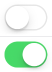
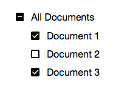

# Toggle UI Controls

Before modern smart phones and tablets entered the marked UI controls for switching on/off states were mostly constrained to checkboxes and radio buttons on desktop systems. With the advent of hand-held touch screens new UI metaphors were introduced to handle cases where users can switch a feature or setting on or off. Most notably, switches (also known as toggles) were introduced for simple binary state changes, e.g. in the Preferences app of the iPhone. As of today, multiple toggle-like UI paradigms coexist based on the use case and target platform.

## Use Cases and Form Factors

|     | Control Type | Desktop Platforms | Touch Platforms | Use Cases  |
| --- | ------------ | ----------------- | --------------- | ---------- |
|  |Switch | All | All | **Use for selecting a single settings option taking effect immediately.** Toggles switch between exactly two mutually exclusive options (on or off), independent of any other options presented on the same screen |
|   | Checkmark | Presented as checkbox | All | **Use for selecting multiple options from a set.** The checkmark indicates that an item was selected or marked. Always requires additional action to take effect. |
|    | Checkbox | All | Android, UWP | **Use for selecting a single or multiple options, mostly in settings dialogs, property panels, or forms.** Most Checkbox implementations support mixed (also known as indeterminate) state. The checkbox interaction might have an immediate effect (e.g. System Preferences on macOS) or might require additional confirmation to take effect (e.g. OK, Cancel, Apply buttons on Windows) |
|  | Radio Button | All | Android, UWP | **Choose one of a set of mutually exclusive options, each represented by a distinct radio button.** Radio button choices always require additional confirmation to take effect (e.g. OK, Cancel buttons). |

## Toggle Control Architecture

Boden abstracts Toggle control types to allow for responsive behavior with regard to the chosen target platform and device form factor.

The following table shows abstracted class types, properties, and UI control appearances with regard to the platform.

| Class | State | Effect | Desktop Appearance | Touch Appearance |
| ----- | ------| ------ | ------------------ | ----------------- |
| **Toggle** | Binary (On/Off) | Immediate | Checkbox | Switch | Switch |
| **Switch** | Binary (On/Off) | Immediate | Swich (substituted) | Switch | Switch |
| **Checkmark** | Binary (On/Off) | After confirmation | Checkbox | Checkmark |
| **Checkbox** | On, Off, Mixed | Immediate or after confirmation | Checkbox | Checkbox (substituted) |
| **RadioButton** | Binary (mutually exclusive in group) | After confirmation | Radio button | Radio Button |

**Toggle** is used as a responsive default class abstracting away the choice of a concrete control type on different platforms from the user. Using **Toggle** yields a checkbox control and on desktop platforms and a switch control on mobile platforms. If the a platform does not support the underlying control type, a substitution will be used.

## Binary State vs. Tri-State

Besides appearance, the most important discrepancy between different control implementations is state. While **Toggle**, **Checkmark**, and **RadioButton** provide a binary on/off option 
only, **Checkbox** also offers a third mixed (or indeterminate) state.

Mixed state means that the checkbox indicates the value of *multiple* binary properties with different values. Consequently, this state only makes sense if the checkbox is used to represent the state of more than one binary value.

Consider the following example of a file hierarchy:

In this example checkboxes represent whether a file or directory is in the "selected" state. As "Document 1" and "Document 3" are currently selected, but "Document 2" is not, the state of the parent directory named "All Documents" is mixed – it is either true and false or neither true nor false. If all children of "All Documents" are selected, "All Documents" will be in selected state ("on"). If all children of "All Documents" are deselected, "All Documents" will be in deselected state ("off").

Clicking on a checkbox which is currently in mixed state sets it to selected state ("on"). When this happens in the example above, the view model must take care of also setting all children document checkboxes to selected state.

**Users can only indirectly set mixed state on a checkbox**. They have to interact with other UI controls to produce a mixed state of multiple on/off states which is then represented as "mixed" in summary.

While binary state can be expressed as a simple boolean type which is straight forward to connect to existing data models, mixed state cannot safely be interpreted as a boolean type. While it is still safe to set a boolean state on a mixed state checkbox, it is not safe to read its value as a boolean type. Hence, the Checkbox class represents state as an enum type named `TriState`.

## Native Checkbox and Switch Platform Controls

| Platform | Control | Appearance | Label | Text on Switch | Comments |
| -------- | ------- | ---------- | ----- | -------------- | -------- |
| macOS | [`NSButton`](https://developer.apple.com/documentation/appkit/nsbutton?language=objc) | Checkbox | X | - | |
| Win32 | [`CreateWindowEx`](https://msdn.microsoft.com/en-us/library/windows/desktop/aa367854(v=vs.85).aspx) | Checkbox | X | - | |
| Win UWP | [`ToggleSwitch`](https://docs.microsoft.com/en-us/previous-versions/windows/apps/hh701411(v=win.10)) | Switch | X (On/Off)* | X | Label above, "On"/"Off" label on the right of the switch. |
| iOS | [`UISwitch`](https://developer.apple.com/documentation/uikit/uiswitch) | Switch | - | - | |
| Linux | [`Gtk::CheckButton`](https://developer.gnome.org/gtkmm/stable/classGtk_1_1CheckButton.html) | Checkbox | X | - | |
| Linux | [`GtkSwitch`](https://developer.gnome.org/gtk3/stable/GtkSwitch.html) | Switch | - | X |Text on switch encoded in language file, cannot be changed easily. |
| Android | [`android.widget.Switch`](https://developer.android.com/reference/android/widget/Switch.html) | Switch | - | X | Derives from [`android.widget.CompoundButton`](https://developer.android.com/reference/android/widget/CompoundButton.html) (implementing `setChecked()`). |
| Android | [`android.widget.CheckBox`](https://developer.android.com/reference/android/widget/CheckBox.html) | Checkbox | X | - | Only in older Android versions |
| Web (DOM) | `<input type="checkbox"/>` | Checkbox | X | - | Mixed state is not supported on some mobile platforms   |

## Platform Support Matrix

| Platform | Checkbox | Switch | Checkmark | RadioButton |
| -------- | -------- | ------ | --------- | ----------- |
| macOS | X | - | - | X |
| Win32 | X | - | - | X |
| Linux GTK | X | X | - | X |
| Win UWP | X | X | - | X |
| iOS | - | X | X | - |
| Android | X | X | - | X |
| Web | X | - | - | X |

## Substitutions

Boden substitutes Checkbox and Switch controls on platforms that do not provide a native implementation. The following substitutions are provided:

### Switch

* macOS: Custom `NSView` implementation mimicking the iOS switch look and feel
* Win32: Owner-drawn control conforming to set system colors
* Web: Custom DIV styled with CSS

### Checkbox

* iOS: Custom `UIView` simimilar to the appearance of checkboxes on iOS Safari

## Links

* [Indeterminate checkbox for web (based on CSS)](https://css-tricks.com/indeterminate-checkboxes/)
* [Tri-state Checkbox: Which State Should be Selected After Clicking?](https://ux.stackexchange.com/questions/3938/tri-state-checkbox-which-state-should-be-selected-after-clicking)