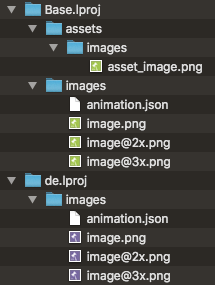
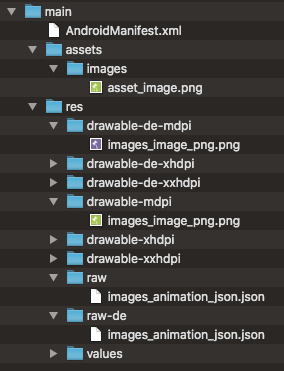

# Bundling Resources

## Introduction

Many platforms provide native ways to bundle application resources 
like images or other binary data. 
The way these are embedded into the build process and the specific 
capabilities of these mechanisms vary quite a bit though.

As an example let's compare the iOS and Androids resource system.

### iOS

Example folder structure:



iOS .app bundles contain a `Resources` folder that is meant to host the applications binary data.
Inside you can create subfolders with the extension `.lproj` that can host 
different versions of a file for different languages ( e.g. `de.lrpoj` or `en-US.lproj`). 
The special `base.lproj` is used the specify the default such that files not found in a specific
language bundle will be looked up in it.
The directory structure inside these can be defined by the user arbitrarily.

### Android

Example folder structure:



Android on the other hand follows a different approach. 
It defines a rigid structure per type of resource.
An image, for instance, needs to be in a folder called `res/drawables` 
while a json file might be stored in `res/raw`. 
To specify the language ( and other selections like e.g. the dpi etc. ) 
you add this information to the folder name: `res/drawables-hidpi-en-US`.

Users cannot create subfolders inside these folders. Trying to do so may
result in compile errors, and the files are simply not accessible.

Android has another mechanism for distributing files with the application called `assets`.
The asset folders structure can be defined by users and it can house any type of data.
However, a downside is that its content cannot be automatically localized.

## Boden representation of resources

Boden abstracts all these intricacies into a platform agnostic json file:

```json tab="Basic layout"
{
    "name" : "main",
    "root-path" : "./Resources",
    "resources" : [
        {
            "language" : "",
            "android-qualifiers" : "",
            "images" : [ ],
            "raw" : [ ]
        },
        {
            "language" : "de",
            "android-qualifiers" : "",
            "images" : [ ],
            "raw" : [ ]
        }
    ],
    "assets" : [ ]
}
```

```json tab="Full example"
{
    "name" : "main",
    "root-path" : "./Resources",
    "resources" : [
        {
            "language" : "",
            "android-qualifiers" : "",
            "images" : [
                {
                    "bundle_path" : "images/image.png",
                    "resolutions" : {
                        "0.75x" : "",
                        "1.0x" : "image.png",
                        "1.5x" : "",
                        "2.0x" : "image@2x.png",
                        "3.0x" : "image@3x.png",
                        "4.0x" : ""
                    }
                }
            ],
            "raw" : [
                {
                    "bundle_path" : "images/animation.json",
                    "file": "flag.json"
                }
            ]
        },
        {
            "language" : "de",
            "android-qualifiers" : "",
            "images" : [
                {
                    "bundle_path" : "images/image.png",
                    "resolutions" : {
                        "0.75x" : "",
                        "1.0x" : "de/image.png",
                        "1.5x" : "",
                        "2.0x" : "de/image@2x.png",
                        "3.0x" : "de/image@3x.png",
                        "4.0x" : ""
                    }
                }
            ],
            "raw" : [
                {
                    "bundle_path" : "images/animation.json",
                    "file": "de/flag.json"
                }
            ]
        }
    ],
    "assets" : [
        {
            "bundle_path" : "images/asset_image.png",
            "file": "image.png"
        }
    ]
}
```

To include a `resource.json` file into the targets build process use the following code in your CMake file:

```cmake tab="Basic"
roger_add( "TARGET_NAME" OUTPUT "PATH_TO_JSON")
add_executable( "TARGET_NAME" main.cpp ${OUTPUT})
```

```cmake tab="NavigationViewDemo example"
roger_add(
    navigationviewdemo
    NAVIGATIONVIEWDEMO_RESOURCES
    ${CMAKE_CURRENT_LIST_DIR}/../DemoAssets/demo_resources.json)
# ...
add_universal_executable(
	navigationviewdemo 
	TIDY SOURCES 
	${NAVIGATIONVIEWDEMO_FILES} 
	${NAVIGATIONVIEWDEMO_ASSETS} 
	${NAVIGATIONVIEWDEMO_RESOURCES})
```

## Using resources

To reference resource files inside your code use one of the following schemes:

| Scheme | Meaning |
|--------|---------|
| image:// | An image specified in the "images" section | 
| resource:// | An arbitrary file specified in the "raw" section | 
| asset:// | An arbitrary file specified in the "assets" section |

All Boden classes will understand how to interpret these paths. Borrowing the resource file
from the previous sections json example:

```c++
auto image = std::make_shared<ImageView>();
image->url = "image://main/images/image.png";
```

To get a platform specific representation of the path use the 
[Application::uriToBundledFileUri](../../reference/foundation/application.md#resources) function:

```c++
// On Android this will return "file:///android_asset/test/index.html"
bdn::App()->uriToBundledFileUri("asset://main/test/index.html") 
```

## Automatic flattening

As discussed previously, Android does not support subdirectories in its resource folders. Therefore the `roger` utility
will flatten any directory structure by replacing all `/` with `_`. Additionally, when accessing resources, 
the extension is ignored by android. Therefore `roger` will append the extension twice, but replace the `.` with an `_`
as well:

| Original | Flattened (Android) |
| -------- | ------------------- |
| images/image.png | images_image_png.png |

